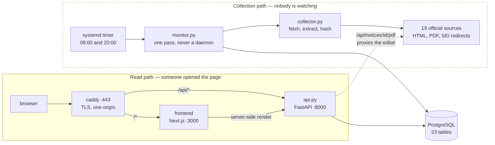
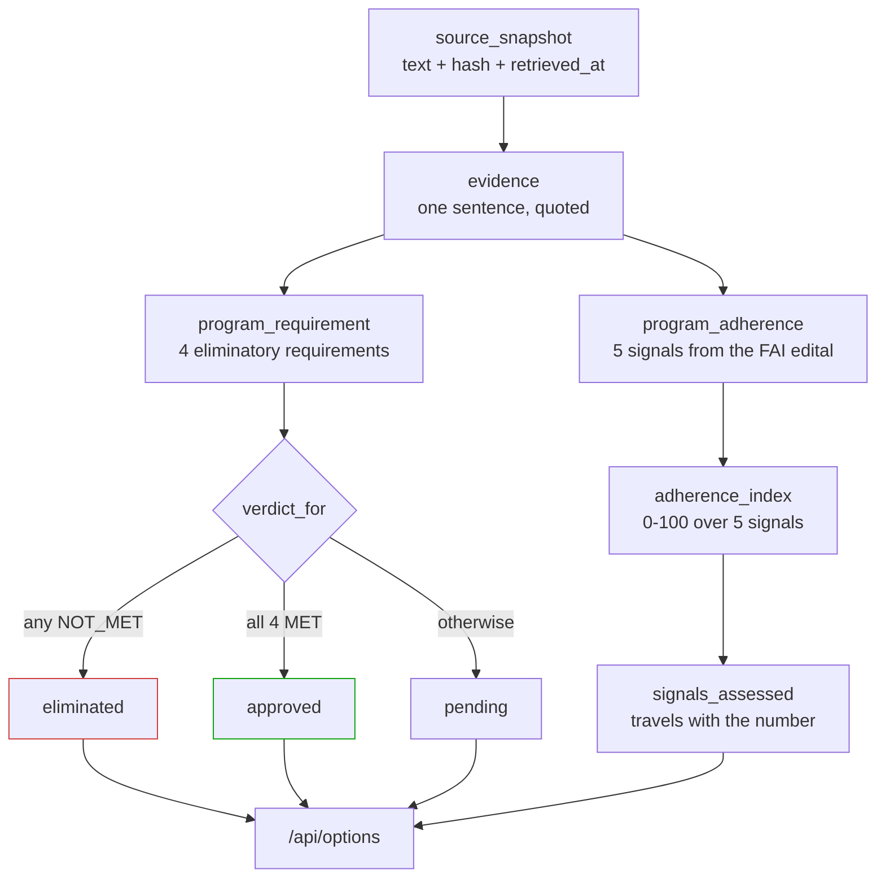
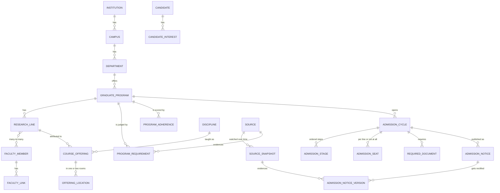

# GradRadar

> Discover, compare, and track graduate opportunities.

GradRadar is a self-hosted system for discovering, organizing, comparing, and tracking graduate programs
and academic opportunities.

The project is initially focused on tuition-free, in-person graduate programs in Computer Science, Artificial
Intelligence, Machine Learning, Natural Language Processing, Large Language Models, Software Engineering, and
related fields in São Carlos, Brazil — especially programs connected to the UFSCar Department of Computing and
the USP Institute of Mathematics and Computer Sciences (ICMC).

**Status:** the domain model, a read API, the dashboard and automated monitoring are all running. Ten
programmes swept, one open call tracked, notifications still pending. See [Roadmap](#roadmap).

---

## Getting started

Requirements: [Nix](https://nixos.org) with flakes, [direnv](https://direnv.net), and Docker. Everything else
comes from the dev shell — nothing is installed on the host.

```bash
direnv allow                 # once per clone: loads the devShell from flake.nix
cp .env.example .env         # then change POSTGRES_PASSWORD
just dev                     # builds and starts the whole stack
```

Open <https://pos.v1cferr.dev>.

Run `just` with no arguments to list every recipe. The most useful ones:

| Recipe | What it does |
| --- | --- |
| `just dev` | Start the stack with hot reload, in the foreground |
| `just up` | Same, detached |
| `just logs [service]` | Follow logs — all services, or one (`just logs backend`) |
| `just down` | Tear down, preserving volumes |
| `just fresh` | **Destructive** — drop volumes (database included) and rebuild |
| `just psql` | Open `psql` against the project database |
| `just migrate` | Apply pending Alembic migrations |
| `just seed` | Load every verified fact (idempotent) |
| `just monitor` | Run one collection pass by hand — the timer does this twice a day |
| `just test` | Backend tests + lint (unit + integration) |
| `just e2e` | Browser tests against the running stack (Playwright) |
| `just ingress` | Show where the reverse proxy lives and its current status |

### Things worth knowing

- **The reverse proxy is not part of this repo.** `pos.v1cferr.dev` is served by the central Caddy declared in
  the dotfiles (`system/services/caddy.nix`), which owns the TLS certificate and the loopback port map for
  every self-hosted project on the machine. See [`deploy/README.md`](deploy/README.md). Its logs are in
  `journalctl -u caddy`, not in `just logs`.
- **There is no login, and that is a decision, not a gap.** The page is open from anywhere. Nothing on it is
  private — it shows public admission calls and our reading of them, and no candidate's name is ever rendered.
  A login would also kill the link preview, which is the whole delivery mechanism: a crawler that hits a
  password wall reads the password wall. See [`docs/SEM-LOGIN.md`](docs/SEM-LOGIN.md) for the trip-wire that
  would reverse this.
- **PostgreSQL is published on `127.0.0.1:5433`, not 5432.** Port 5432 on this host already belongs to another
  project's container. Inside the compose network the database still listens on 5432, which is the port that
  goes in `DATABASE_URL`.
- **The published ports are `3006` (frontend) and `8006` (API), loopback only.** They are the interface with
  Caddy, not with the network. Changing them requires changing the port map in the dotfiles module too.
- **`.env` is not optional.** The compose file loads it via `env_file`, and `just` refuses to start without it.
- **Changing a frontend dependency? Use `just rebuild-frontend`, not a plain restart.** The container is
  Alpine (musl) and the host is glibc; installing over an existing `node_modules` volume after the dependency
  graph changes leaves a mixed tree, and the symptom is an opaque `Cannot find module
  '…linux-x64-musl.node'` with HTTP 500.

### Testing

Three layers, each answering a question the others cannot:

| Layer | Command | What it proves |
| --- | --- | --- |
| unit | `just test` | domain rules, no I/O |
| integration | `just test` | the real app against the real PostgreSQL, in-process via httpx `ASGITransport` — no server |
| e2e | `just e2e` | a browser renders the data, through Caddy |

Playwright is deliberately **not** used for the API: `ASGITransport` calls FastAPI in the same process, so
those tests need no server and finish in milliseconds. Playwright earns its place only where a real browser
does.

---

## Architecture

### The backend has two front doors, not one

Most of this kind of system is a request/response API. This one also runs on a **schedule**, and the scheduled
half is the reason the project exists: an admission call that nobody notices is indistinguishable from an
admission call that never happened.



Two things in that picture are deliberate and easy to get wrong:

- **The monitor is a single pass, not a daemon.** The schedule lives outside the process, in a systemd timer
  declared in the dotfiles. A scheduler inside the API process would die with the container, and `restart: "no"`
  in the compose file means it would stay dead. `Persistent = true` on the timer matters too: this is a desktop
  that spends nights powered off, and a missed check must run late rather than vanish.
- **`/api/notices/{id}/pdf` exists because of `X-Frame-Options`.** UFSCar serves its editais with
  `SAMEORIGIN`, so an `<iframe>` pointing at the original URL renders blank with no error. Served through our
  own origin, it embeds. The URL always comes from the database row, never from a parameter — a URL parameter
  would make this an open proxy.

### How a fact becomes a decision

Every verdict in the system is derived, never typed in. The two axes are kept apart on purpose: one decides
whether a programme is *possible*, the other whether it is *worth it*.



The asymmetry is the core rule: **one proven failure eliminates, but the absence of failures does not
approve.** Only four verified requirements approve. And `unknown` is never treated as `no` — the PPGCC was
eliminated by evidence, while its tuition status remains unverified, and collapsing those two would erase the
difference between a fact and a gap. Gaps are what turn into work.

The index deliberately keeps a **fixed denominator** of five signals with `unknown` worth zero. Normalising by
what is already known would score a programme with one strong signal at 100%, and a number like that invites
the wrong decision. `signals_assessed` therefore travels with the index everywhere it is displayed.

### The domain model



Four shapes here were forced by something observed on a real page, and each would silently lose information if
simplified:

| Shape | Why it cannot be simpler |
| --- | --- |
| `discipline` separate from `course_offering` | a course exists for years; its weekday and time belong to one semester |
| `admission_seat.research_line_id` nullable | the PPGCC allocates seats per line; the PPGPEP explicitly does not |
| `faculty_research_line` as many-to-many | one member appears under two lines, another under none |
| `source_snapshot` as its own table | a fact belongs to a *retrieved document*, at a *moment*, with a *hash* — not to a `source_url` column |

| Layer | Choice |
| --- | --- |
| Frontend | Next.js 15 (App Router), TypeScript, Tailwind v4 |
| Backend | FastAPI, SQLAlchemy 2.0 (async), Python 3.13 |
| Database | PostgreSQL 17, self-hosted in a container |
| Reverse proxy | Caddy 2 (central, in the dotfiles), wildcard Let's Encrypt cert |
| Dev environment | Nix flake dev shell + direnv; `uv` for Python, `pnpm` for Node |
| Task runner | `just` |

`flake.nix` provides the **host** toolchain only — editor/LSP tooling and the CLIs `just` invokes. Application
dependencies live in `backend/uv.lock` and `frontend/web/pnpm-lock.yaml`, and the runtime always runs in
containers. This keeps the host machine clean and the environment reproducible per clone.

### Layout

| Path | What lives there |
| --- | --- |
| `backend/app/collector.py` | fetch one URL and reduce it to comparable text. Follows redirects, extracts PDFs, hashes the **text** and not the bytes |
| `backend/app/monitor.py` | one pass over every active source; `python -m app.monitor` |
| `backend/app/api.py` | read endpoints, plus the edital PDF proxy |
| `backend/app/models/` | `academic`, `curriculum`, `admission`, `provenance`, `eligibility`, `candidate` |
| `backend/app/seed.py` | every verified fact, idempotent, with the evidence sentence attached |
| `backend/alembic/` | 7 migrations. The app never calls `create_all` |
| `frontend/web/src/app/` | dashboard — deadline hero, options table, next steps, weekly grid, monitoring |
| `docs/` | the decisions: `GOAL`, `ADERENCIA`, `PROGRAMAS`, `AUTOMACAO`, `SEM-LOGIN`, `METADADOS`, `research/` |
| `deploy/README.md` | points at the central Caddy in the dotfiles |

The dotfiles own two units for this project: `grad-radar.service` brings the stack up at boot, and
`grad-radar-monitor.timer` runs the collector twice a day.

---

## Motivation

Information about graduate programs is fragmented across institutional websites, admissions notices, PDF
documents, faculty pages, research group websites, academic calendars, and application systems. That makes
practical questions hard to answer:

- Which programs are currently accepting applications, and when is the next notice published?
- Which ones are in person and tuition-free?
- Which research lines involve AI, NLP, or LLMs, and which faculty members are accepting students?
- Are the class schedules compatible with a full-time job?
- Which documents are required, and is special-student enrollment available first?
- Which scholarships exist, and do they forbid formal employment?
- Which opportunities actually match each candidate's academic and professional goals?

GradRadar centralizes this into a structured decision-making system, tracked per candidate.

## Scope

Ten programmes have been swept and judged so far — the full UFSCar catalogue of 47 was screened, and the
São Carlos candidates that touch the target work were investigated one by one. Exactly **one** passes all four
eliminatory requirements. The uncomfortable finding, now measured rather than asserted: the three most adherent
programmes in the sweep are all eliminated on schedule, because technical AI lives in the *academic* programmes
and classes outside business hours live in the *professional* ones. See [`docs/PROGRAMAS.md`](docs/PROGRAMAS.md).

Planned modules: program catalog, research lines, faculty and laboratories, admissions notices with version
diffing, courses and schedules, costs and scholarships, document checklists, a per-candidate application
pipeline, and opportunity scoring. The analysis structure is:

```
institution → program → research area → faculty member → laboratory → project → course
```

The system supports multiple candidates, each with independent interests, schedule constraints, document
checklist, application history and scores.

## Roadmap

| Phase | Contents | State |
| --- | --- | --- |
| F0 | Dev shell, compose stack, central Caddy, PostgreSQL, boot unit | done |
| F1 | Domain model, Alembic, verified seed, read API | done |
| F2 | Filters and opportunity scoring — the adherence index | done; CRUD not needed yet |
| F3 | UI — options table, deadline lead, next steps, weekly grid, edital viewer | done |
| F5 | Monitoring — 19 registered sources, page and PDF change detection, systemd timer | done |
| **F4** | **Notifications — deadline and change alerts** | **next** |
| F6 | Extraction — turn a schedule document into a verdict without a human reading it | planned |

F5 was originally planned last, on the principle that the manual workflow had to be validated first. It moved
up because the validation produced its own conclusion: the manual sweep works but does not repeat itself, and
the deadline that matters can appear on any Tuesday.

What F6 means concretely: reading `8h às 12h` and `14h às 17h` out of a PDF and concluding *no evening class*
is mechanical, and it was done by hand six times. Six real documents with known answers already exist as
regression fixtures. Judging **adherence**, by contrast, is reading comprehension and stays human.

[`docs/AUTOMACAO.md`](docs/AUTOMACAO.md) argues where a local model helps and where it makes things worse —
including why the schedule detection should stay a regex, and the one rule that does not bend: **a model is
never the source of a date.**

## Development principles

- Official sources first, and always preferred over third-party aggregators.
- Traceable, verifiable information — preserve the original source and record when it was last checked.
- Manual-first MVP; automation only after the domain is validated.
- Self-hosted whenever practical, with reproducible development environments.
- Multiple candidate support from the start.
- English-first codebase and documentation.

## License

To be defined.
